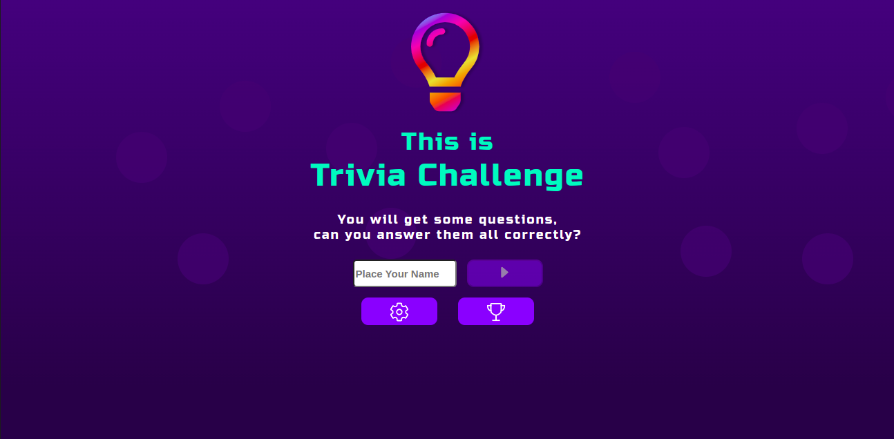
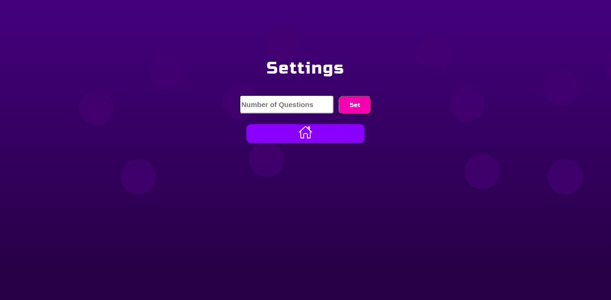
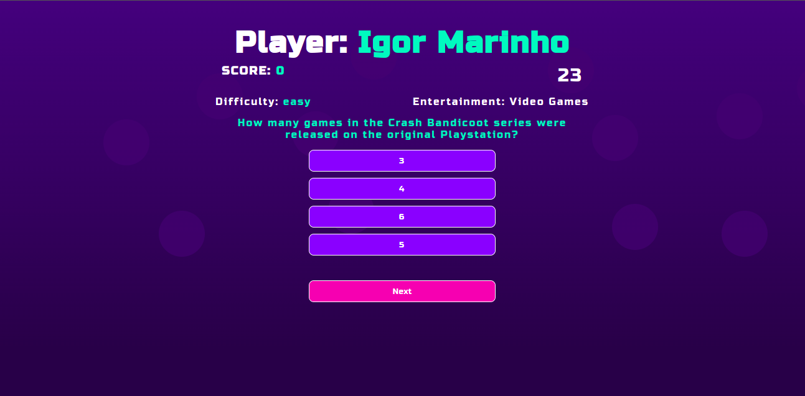
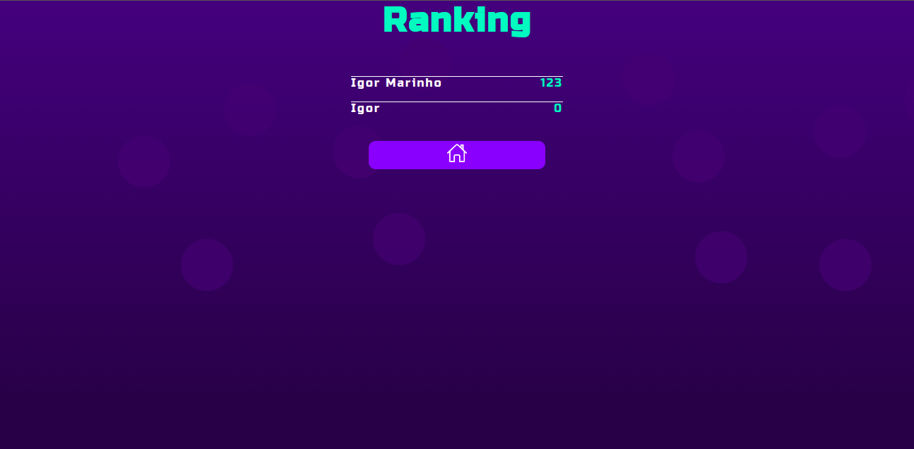

# Trivia Game Project

  

  
  
  
    
  
  

  
<h2>:brazil: Português</h2>

  Esse foi um projeto desenvolvido no módulo de Frontend no curso de Desenvolvimento Web Full Stack da Trybe.  
  O desenvolvimento se deu como uma atualização de um projeto elaborado em parceria com os amigos: <a href="https://github.com/onoue9">Filipe Onoue</a>, <a href="https://github.com/JunioASilva">Junio Álves</a>, <a href="https://github.com/brunophilippi">Bruno Philippi</a> e <a href="https://github.com/lucas-morais">Lucas Toledo</a>, utilizando Metodologias Ágeis(SCRUM) com o uso de Kanban(pelo Trello). 
   O projeto original tinha como foco o uso da transferência de informação e gerenciamento de estado com o Redux, contudo, poucos dias após o desenvolvimento desse projeto foi lançado o Redux Toolkit, me inspirando a refazer o mesmo projeto com o Redux Toolkit. Esse projeto foi elaborado com a técnica Mobile First e posteriormente reajustado para telas maiores.  
   O design desse projeto foi inspirado em um projeto de design do <a href="https://www.figma.com/community/file/1124158145014892602">Jeziel Junior</a>, disponível no <a href="https://www.figma.com/community/file/1124158145014892602">Figma</a> e desenvolvido com a ferramente SASS.  
  
  
  ## Objetivos
  * Usar Redux ToolKit para gerenciar e transferir estados e informações entre páginas e componentes;
  * Desenvolver primariamente para telas pequenas fazendo a estilização utilizando o SASS;
  * Funcionar como um app do tipo game de perguntas e respostas com pontuação e ranking local;
  * Consumir API do openDB para obtenção de token de acesso e uso do token para acesso ao conteúdo.  

  ## Live Link
  <a href="https://educational-trivia-game.netlify.app/" target="_blank">Trivia Game</a>  
  
  ## Screenshot
  
  
  
    
  
  ## Tecnologias usadas
  * React
  * React Router
  * Redux Toolkit
  * React Components 
  * HTML
  * SASS
  * Javacript  
  
  ## Como usar
  Acesse o site, navegue na página de configurações e configure a quantidade de perguntas que haverão no turmo. volte a página principal, preencha o nome do usuário e clique para iniciar o jogo. Ao final o usuário poderá acessar e ver o ranking local. 
  *Por padrão, o número de questões do jogo é de 5 questões.  
      
  ## Rodar Localmente
  ### Requisitos:
   * Node v16
   * Google Chrome
    
  ### Clonar no seu computador (via SSH)
  No terminal:
  
    git clone git@github.com:IgorMarinhoArgollo/trivia-game.git
    npm install
  

  ### Iniciando o projeto localmente
  No diretório em que o repositório foi clonado, cole o seguinte comando no terminal para iniciar a aplicação localmente:
   
      npm start

  

  ## Como contribuir no projeto
  1. Faça um **fork** do projeto;
  2. Crie uma nova branch com as suas alterações: `git checkout -b my-feature`;
  3. Salve as alterações e crie uma mensagem de commit contando o que você fez: `git commit -m "feature: My new feature"`;
  4. Envie as suas alterações: `git push origin my-feature`;
  5. Abra o seu pull-request na página do GitHub.  
  
  
##  Autors
<table>
  <tr>
    <td align="center"><a href="https://www.linkedin.com/in/igormarinhoargollo/"> <b>Igor Marinho</b></a></td>
    <td align="center"><a href="https://www.linkedin.com/in/filipeonoue/"> <b>Filipe Onoue</b></a></td>
    <td align="center"><a href="https://www.linkedin.com/in/junio-alves-da-silva-b795a2217/"> <b>Junio Alves</b></a></td>
    <td align="center"><a href="https://www.linkedin.com/in/bruno-philippi/"> <b>Bruno Philippi</b></a></td>
    <td align="center"><a href="https://www.linkedin.com/in/lucas-m-toledo/"> <b>Lucas Toledo</b></a></td>
  </tr>
</table>

  

  ## Licença
  Esse projeto está sob a licença:
    

##  
## :us: English

This was a project developed in the Frontend module in the Full Stack Web Development course at Trybe.  
  The development took place as an update of a project developed in partnership with friends: <a href="https://github.com/onoue9">Filipe Onoue</a>, <a href="https://github .com/JunioASilva">Junio Álves</a>, <a href="https://github.com/brunophilippi">Bruno Philippi</a> and <a href="https://github.com/lucas -morals">Lucas Toledo</a>, using Agile Methodologies (SCRUM) with the use of Kanban (by Trello). 
   The original project was focused on the use of information transfer and state management with Redux, however, a few days after the development of this project, I've learned Redux Toolkit, so inspiring me to redo the same project with Redux Toolkit. This project was developed using the Mobile First technique and later readjusted for larger screens.  
   The design of this project was inspired by <a href="https://www.figma.com/community/file/1124158145014892602">Jeziel Junior</a>, available at <a href="https: //www.figma.com/community/file/1124158145014892602">Figma</a> and developed with the SASS tool.  

## My Goals
  * Use Redux ToolKit to manage and transfer states and information between pages and components;
  * Develop primarily for small screens doing the styling using SASS;
  * Function as a trivia game type app with local score and ranking;
  * Consume openDB API to get access token and use token on another endpoint to access content.  

## Live Link
  <a href="https://educational-trivia-game.netlify.app/" target="_blank">Trivia Game</a>  
  
## Screenshot

  

## Used Technologies
  * React
  * React Router
  * Redux Toolkit
  * React Components 
  * HTML
  * SASS
  * Javacript  

## How to use it
  Access the website, navigate to the settings page and configure the number of questions that will be in the quiz. Go back to the main page, fill in the username and click to start the game. At the end the user will be able to access the local ranking. 
  *By default, the number of questions in the game is 5 questions.  
        
## Run Locally
  ### Requirements:
   * Node v16
   * Google Chrome
    
  ### Cloning into your computer (via SSH)
  On terminal:

      git clone git@github.com:IgorMarinhoArgollo/trivia-game.git
      npm install

  ### Starting project locally
  On the directory that you have cloned the repository, paste the command on terminal to start the application:

      npm start

  

## How to contribute on the project
  1. Make a **fork** of the project;
  2. Create a new branch with your changes: `git checkout -b my-feature`;
  3. Save your changes and create a commit message explaining what you have done: `git commit -m "feature: My new feature"`;
  4. Send your changes: `git push origin my-feature`;
  5. Open your pull-request on GitHub.  
  
  
##  Author
<table>
  <tr>
    <td align="center"><a href="https://www.linkedin.com/in/igormarinhoargollo/"> <b>Igor Marinho</b></a></td>
    <td align="center"><a href="https://www.linkedin.com/in/filipeonoue/"> <b>Filipe Onoue</b></a></td>
    <td align="center"><a href="https://www.linkedin.com/in/junio-alves-da-silva-b795a2217/"> <b>Junio Alves</b></a></td>
    <td align="center"><a href="https://www.linkedin.com/in/bruno-philippi/"> <b>Bruno Philippi</b></a></td>
    <td align="center"><a href="https://www.linkedin.com/in/lucas-m-toledo/"> <b>Lucas Toledo</b></a></td>
  </tr>
</table>
   
 
## License
  This project is under license:
    
